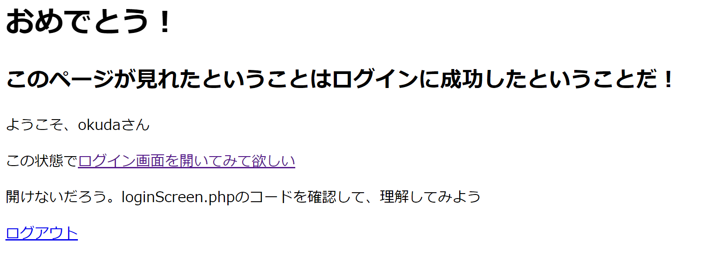
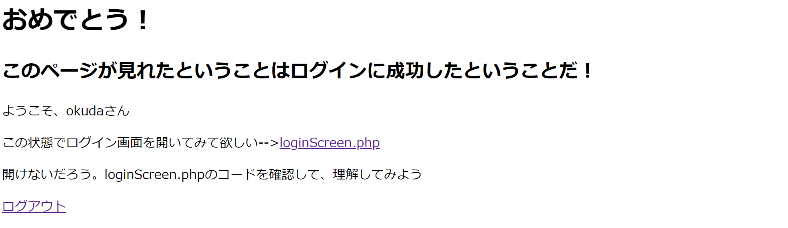
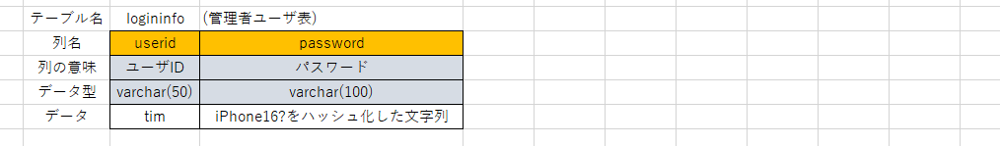

# 提出について

```
## 最終提出 12月22日(金)18:00 までに以下のものを提出

```
kadai03  
　 |-loginScreen.php(ログイン画面)  
　 |-loginCheck.php(ログイン機能)  
　 |-loginSuccessScreen.php(ログイン成功画面)  
　 |-logout.php(ログアウト機能)  
　 |-userManagerScreen.php(ログイン情報管理画面)  
　 |-userManager.php(ログイン情報管理機能)  
　 |
　 |-作業日報.xlsx(毎授業後に入力しておくこと)
```

## 提出について諸注意
- 提出フォルダ「Reports/出席番号/」
-  期限以降は、いかなる理由であろうと受け取りません。
-  最終提出日において、動作しない状態での提出は、再提出となります。
-  提出課題の評価は、作品の他、日報など提出を求められたものを全て評価対象とする


# ログインだけするサイト(kadai03)
ログイン画面で、ログインボタンを押すとログイン機能で検査する。成功すればログイン成功画面を表示

## ログイン情報の作成
loginフォルダ内に以下のファイルを作成する
- ファイル名「steve.txt」
- データ「iPhone15!」

## ログイン成功画面(loginSuccessScreen.php)の作成
1. 以下のようなログインに成功した旨を称えるページを作成する


## ログイン画面(loginScreen.php)の作成
1. 以下のようなログイン画面を作ろう

- [参考：初心者向けformの作り方](https://webliker.info/html/79009/)
- [参考：inputについて](https://webliker.info/html/39533/)
- ログインボタンを押下すると、ログイン機能(loginCheck.php)にPOSTメソッドでリクエストします。

## ログイン機能(loginCheck.php)の作成
- ログイン画面から渡された情報をもとにログインの可否を検査します。
1. POSTメソッドで送られてきたデータを保存

1. 次のフォルダにテキストファイルが存在するかを確認  
./logindata/(ユーザ名).txt ※(ユーザ名)は送られてきた情報を使用する

1. テキストファイルが存在しなければ、ログイン画面へリダイレクト(末尾にGETのURLパラメータでエラーメッセージを付与)  
[参考：ファイルの存在チェック](https://magazine.techacademy.jp/magazine/22088)  
[参考：PHPでリダイレクト](https://magazine.techacademy.jp/magazine/11609)

1. テキストファイルからパスワードを取得
[参考：ファイル操作](https://qiita.com/kouheidev/items/d8ee3b078f75cc331f83)

1. 1.で保存したパスワードと4.で取得したパスワードを比較して一致するか検査

1. 一致しなかったら、3.と同様にログイン画面にリダイレクト(末尾にGETのURLパラメータでエラーメッセージを付与)  

1. 一致した場合、ログイン成功画面(loginSuccessScreen)にリダイレクトする


## ログイン画面(loginScreen.php)の修正
- ログイン機能(loginCheck.php)によって、入力内容に不備があればログイン画面にリダイレクトされます。  
その際にGETメソッドのパラメータとして(URLの末尾に?message=エラーメッセージ)messageにエラーメッセージを載せています。
ログイン画面で、エラーメッセージを表示するように修正します。
- [参考：GETについて](https://codelive.jp/%E3%80%90php%E3%81%AE%E5%9F%BA%E7%A4%8E%E3%80%91get%E9%80%81%E4%BF%A1%E3%81%AE%E6%96%B9%E6%B3%95%E3%82%92%E3%83%9E%E3%82%B9%E3%82%BF%E3%83%BC%E3%81%97%E3%82%88%E3%81%86/)

## 知識を入れるーセッションについて
セッションとは  
- サイトの訪れた個々のクライアントを識別した単位
[参考：セッションについて](https://wa3.i-3-i.info/word1791.html)

セッション変数とは
- サーバ側がセッションごとに保持する情報でphpでは、$_SESSION[]でアクセス可能

セッションとクッキー
- サーバ側で保存するのがセッション
- ブラウザ側で保存するのがクッキー（WEBサーバによって、クライアントに情報を記憶させる）

セッションが開始されると、セッションIDと呼ばれる番号がつくられ、サーバはクライアントPCのブラウザのクッキーにセッションIDを書き込む  
クライアントPCは、同じサイトに再度接続する際、クッキー内のセッションIDを提示し、WEBサーバ側は同じセッションIDに紐付けて保存していたセッション変数にアクセスし、前回の引き続きのセッション（同じクライアント）で使用していた情報を使用することができる  
今回の課題は、ログイン状態を維持するためにセッション変数に値がセットされているかどうかでログインしているかどうかを判断する

## ログイン機能(loginCheck.php)の修正
1. ログインに成功した場合セッションをスタートさせる  
[参考：セッションについて](https://techplay.jp/column/538)

1. セッション変数に、ユーザ名を保存する

## ログイン成功画面(loginSuccess.php)の修正
1. セッションをスタートさせる
1. セッション変数にユーザ名がセットされているかを確認
1. セットされていなければログイン画面(loginScreen.php)にリダイレクト(末尾にGETのURLパラメータでエラーメッセージを付与)  
1. 取得したユーザ名を表示する。

## ログイン成功画面(loginSuccess.php)の修正
1. ログアウト機能(logout.php)へのリンクを持った文字列「ログアウト」を記述

## ログアウト(logout.php)の作成
1. セッションをスタートさせる
1. セッション変数をクリアする
[参考：セッション変数のクリア](https://www.javadrive.jp/php/session/index3.html)
1. セッションを破棄する
1. ログイン画面(loginScreen)にリダイレクトする(末尾にGETのURLパラメータでログアウトした旨のメッセージを付与) 

## 新しいユーザ情報の作成
- ファイル名「jobs.txt」
- 内容「（iPhone16!をMD5でハッシュ化したもの）」
[参考：MD5ハッシュ化計算サイト](https://phpspot.net/php/pg%EF%BC%AD%EF%BC%A4%EF%BC%95%E3%83%8F%E3%83%83%E3%82%B7%E3%83%A5%E8%A8%88%E7%AE%97%E3%83%84%E3%83%BC%E3%83%AB.html)

## ログイン機能(loginCheck.php)の修正
1. ログイン検査に利用するユーザから入力されたパスワードをハッシュ化して検査する
[参考：MD5関数](https://magazine.techacademy.jp/magazine/46549#3)

1. 平文でのパスワード検査をコメントアウトする

## 理解が終わった人への追加課題
- 追加課題による修正は、以前コードを削除しないようにすること（コメントアウトする）
1. 以下のデータベースを作成し、ログイン情報をデータベースに登録し、ログインができるように修正

2. ログイン情報管理画面(UserManagerScreen.php)を作成しログイン画面(loginScreen.php)から遷移できるようにする。(データベースは、課題２で使用したseminar2db)
3. ログイン情報管理機能(UserManager.php)を作成し、以下の機能を追加する
- ユーザの登録
- ユーザの削除
- ユーザの変更